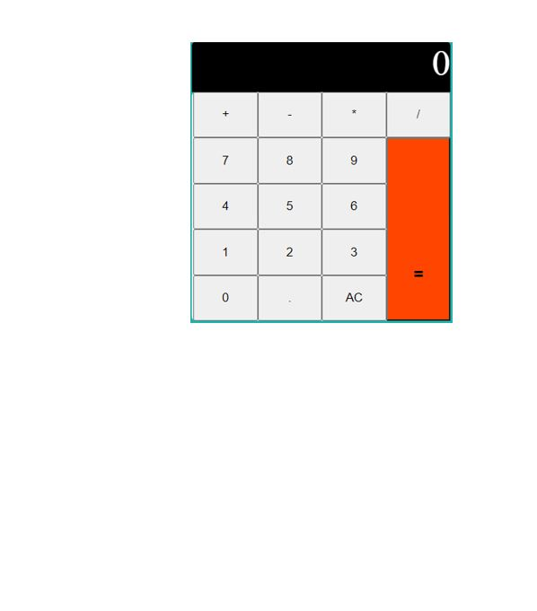
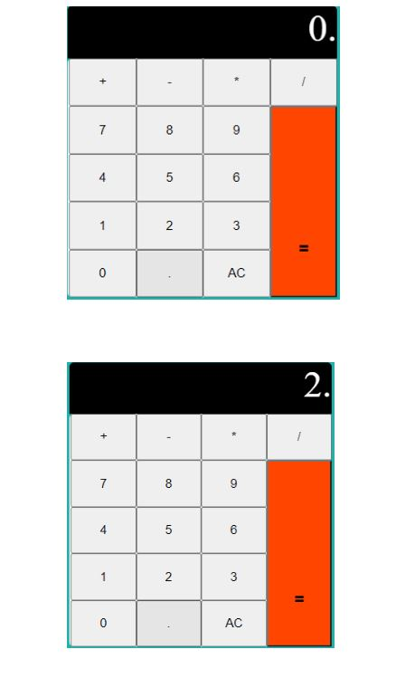
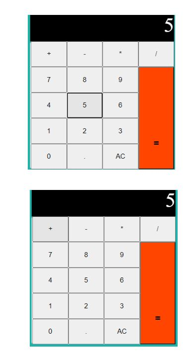
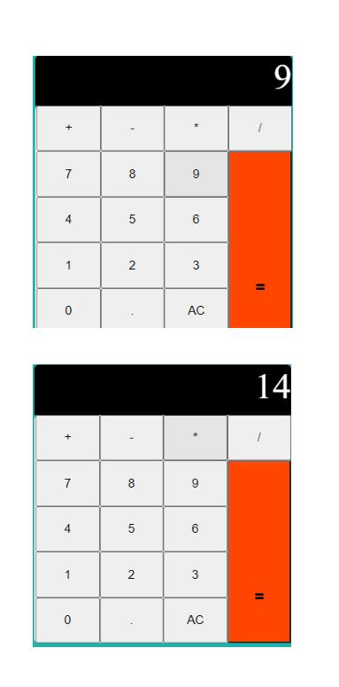
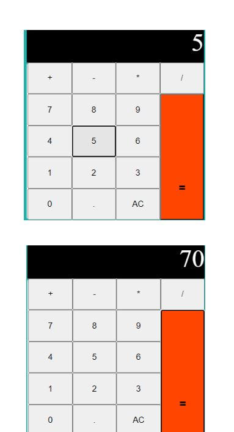

# CALCULATOR

### Technologies Used
* HTML
* CSS
* JavaScript

### DEMO 

This project will consist of two parts: the display and the keys
A person can hit any key out of following:
1.	a number key (0–9)
2.	an operator key (+, -, ×, ÷)
3.	the decimal key(.)
4.	the equals key(=)
5.	the clear key(AC)

The first steps to building this project is to be able to listen for all keypresses and  
determine the type of key that is pressed. 
The calculator has the following keys: 0……9, ., +, -, *, /,  =, AC

When user clicks on number key ,
At first,the calculator shows 0 (the default number), the target number should replace zero.
If the calculator shows a non-zero number, the target number should be appended to the 

displayed number.
         
 

When a user hits an operator key, the operator should be highlighted so user can 
know the operator is active.

If user hits an operator key first, the operator key should light up.
 Nothing should happen if user hits the same operator multiple times.
 

When a user hits the decimal key, a decimal should appear on the display.
 If user hits any number after hitting a decimal key, the number should be appended on the 
display as well.

 

Next, if user hits the decimal key after hitting an operator key, the display should show 0.
 

When a user hits the AC key, the calculator shall reset to its initial state by clearing all 
custom attributes , we have set

When a user hits the equals key, the calculator should calculate a result that depends 
on three values:
1.	The first number entered into the calculator
2.	The operator
3.	The second number entered into the calculator

After the calculation, the result should replace the displayed value.
Nothing should happen if user hits the equals key before any operator keys.

         

           

The project will produce a correct result defined by the well  known Arithmetic rules. 
                                        

 

 

